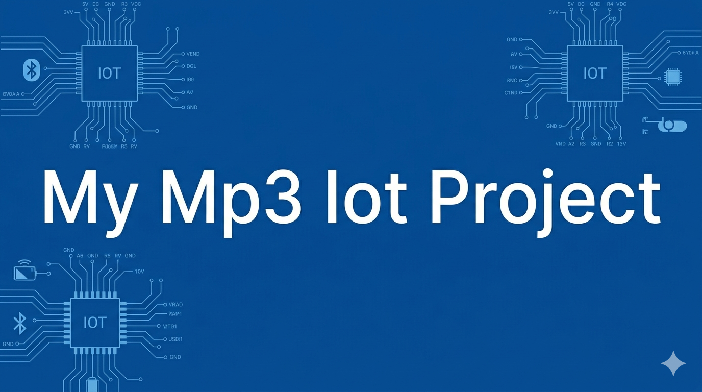

  

  
  
  
  
  

# Auris — Baladeur MP3 nouvelle génération

> **Auris** est un projet étudiant dédié à la musique, pensé pour retrouver le plaisir d'un bel objet d'écoute physique, autonome et durable, enrichi par les technologies d'aujourd'hui.

---

## Sommaire

- [Présentation](#présentation)
- [Qui sommes-nous ?](#qui-sommes-nous-)
- [Pourquoi Auris ?](#pourquoi-auris-)
- [Où en sommes-nous ?](#où-en-sommes-nous-)
- [Le futur d'Auris](#le-futur-dauris)
- [Contributeurs](#contributeurs)

---

## Présentation

Auris est un projet étudiant né de la volonté de réinventer et de retrouver un support physique d'écoute musicale.

Dans un monde où le numérique évolue à grande vitesse, notre démarche consiste à intégrer les technologies actuelles au service d'un format simple, tangible et authentique. L'objectif est de permettre à chacun de **retrouver, posséder et redécouvrir sa musique ainsi que ses artistes préférés**, loin de la surconnexion et des distractions habituelles.

---

## Qui sommes-nous ?

Valentin Barrois et Pierre Untersinger sont les créateurs et fondateurs de ce projet.

Passionnés par le monde du son et de la musique, nous avons fait le choix de retourner vers un format d'écoute plus traditionnel et original. Les grandes plateformes de streaming actuelles sont devenues d'immenses structures collectant en permanence les données et les habitudes de leurs utilisateurs, un modèle dans lequel nous ne nous reconnaissons pas.

Étudiants en informatique au sein de l'école **EPITECH (campus de Marseille)**, nous mettons et mettrons l'ensemble de nos compétences au service de ce sujet qui nous anime. Nous sommes également soutenus et encouragés par notre équipe pédagogique pour mener à bien le développement d'Auris.

---

## Pourquoi Auris ?

Marre de ne plus posséder votre musique ni vos listes de lecture ? **Auris apporte une réponse concrète :**

- **Une vraie propriété de votre musique :** Vos titres et vos albums sont enregistrés directement dans la mémoire de votre matériel. Vous n'avez aucun abonnement qui expire et aucun risque de voir un morceau disparaître du jour au lendemain : vos morceaux vous appartiennent réellement.
- **Se libérer du tout-en-un du smartphone :** Aujourd'hui, notre quotidien est entièrement piloté par un seul et unique appareil, le téléphone portable (notifications, messages, réseaux sociaux). Dissocier l'écoute musicale de cet écran permet de profiter d'un moment privilégié, sans interruption.
- **Une qualité sonore fidèle et sans compromis :** Les plateformes en ligne utilisent des méthodes de compression audio pour réduire la taille des fichiers, ce qui diminue la qualité musicale originale enregistrée par les artistes. Auris est pensé pour préserver la fidélité sonore d'origine et rester compatible avec du matériel audio professionnel.
- **Un appareil presque 100 % hors-ligne :** Aucune obligation de créer un compte, aucun pistage de vos écoutes et aucune dépendance à une connexion Internet permanente pour écouter vos chansons.
- **Une conception durable et éthique :** Un baladeur résistant dans le temps, sans obsolescence programmée, conçu avec des matériaux de bonne facture et respectueux tant de l'environnement que de la main-d'œuvre lors de son cycle de fabrication.

---

## Où en sommes-nous ?

L'état d'avancement actuel du projet repose sur des bases structurées :

1. **Mise en place du dépôt GitHub :** Création de l'espace de suivi et de versionnement qui accompagnera le projet tout au long de nos études.
2. **Réalisation de la Preuve de Concept (PoC) :** Élaboration d'un premier cadre méthodologique définissant les objectifs, la faisabilité et les étapes de test nécessaires pour valider l'idée. *(Pour plus de précisions, se référer au document [poc.md](poc.md)).*
3. **Lancement de la version 0.0.1 :** Après avoir identifié l'ensemble des besoins essentiels, nous commençons le développement du logiciel interne à l'appareil (*le programme de base qui pilote directement les composants électroniques*).
4. **Prochaine étape :** La conception et les tests d'un tout premier circuit électronique de validation.

---

## Le futur d'Auris

Pour la suite, des évolutions majeures sont déjà envisagées. Elles prendront forme au fur et à mesure que le projet atteindra un niveau de maturité plus avancé :

- **Usinage et finitions soignées :** Conception d'un boîtier en pièces usinées de haute qualité, élégant et robuste.
- **Logiciel et application compagnon :** Développement d'un logiciel simple et intuitif pour faciliter le transfert et l'organisation de vos musiques depuis votre ordinateur vers l'appareil.
- **Site web et ressources :** Mise en ligne d'un site vitrine pour présenter le projet, héberger la documentation et partager des guides pratiques.
- Et bien d'autres perspectives à explorer au contact des futurs utilisateurs.

---

## Contributeurs

- Valentin Barrois
- Pierre Untersinger

---

  <i>Auris — Retrouvez le lien avec votre musique.</i>

