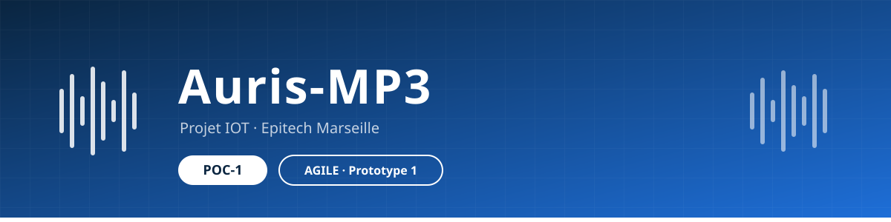

<p align="center">
  
</p>

# Auris-Mp3 | Projet IOT by student of Epitech Marseille


## I. Initiation : Le commencement du Projet
*Cadrage stratégique et validation du concept.*

* **Différenciation - (Mon idée est-elle unique ?):** 
Mon idée n'est pas unique, on reprend un concept existant mais on souhaite l'améliorer, le moderniser. L'idée est de retrouver un support unique pour écouter de la musique (arrêter le streaming digital).

* **Impact - (Ce produit fera-t-il une différence sensible ?):**
Avec un lecteur mp3 de nouvelle génération nous intégrerons le wifi ainsi que le bluetooth pour une meilleure connectivité entre ces différents appareils. La prise en charge de différents formats audio est elle aussi très pertinente. 

* **Faisabilité - (Avons-nous besoin de valider sa faisabilité technique ou économique ?):** 
Grâce au cadre fourni par notre établissement scolaire, nous avons la chance d'accéder gratuitement à nos composants. En termes de bagage technique nécessaire (programmation), nous allons nous en sortir globalement. Le projet évoluera au fil du temps, tout comme le code.

* **Objectifs - (Quels résultats concrets voulons-nous obtenir ?):**
Nous souhaitons dans un premier temps concevoir une première version : celle-ci ne sera pas parfaite, mais elle nous permettra de comprendre et de grandir grâce aux erreurs que l'on commet ou commettra. L'idée aujourd'hui est de **réussir à faire fonctionner un ESP32-S3 avec son DAC (convertisseur numérique-analogique) et un écran OLED pour afficher quelques informations**. Par la suite viendront l'amélioration de notre premier jet et la conception d'un boîtier imprimé en 3D ; le reste sera étudié plus tard.

* **Go/No-Go - (Approbation de procéder à une Preuve de Concept (PoC) ?):** 
Nous avons eu l'approbation de notre référent pédagogique ainsi que celle du dirigeant du HUB (salle d'innovation fournie par notre école). 


## II. Planification : La Feuille de Route
*Définition de l'architecture et de la méthodologie.*

* **Méthodologie - (Comment allons-nous procéder ? (Agile, Cycle en V, etc.)):**
Nous avons choisis la méthode Aglile pour plusieurs raisons. Dans un premier temps dans le monde de l'informatique cette pratique est très répendu et permet une évolution rapide et claire du projet. La deuxième est raison est que nous ne connaissons pas la suite du projet, cette méthode permet de décomposer en plusieurs étape des phases de developpement.
Pour ce premier Sprint voici les étapes:
    - Rédaction du POC
    - Design rapide (améliorer cette phase lors des prochaines versions)
    - Achat de materiel IOT
    - Développement de code c/c++ pour l'esp et ces modules
    - Test du code sur la version du MP3
    - Phase de review du projet construit et terminé
    - Fin et documentation finale (conclusion de ce premier cycle)

```
Partie à mettre à jour !

* **Flux de données :**
    * Quelles seront les **entrées** (Inputs) ?
    * Quelles seront les **sorties** (Outputs) ?
    * Quels seront les **processus de transformation** ?
```

* **Ingénierie - (Spécifications techniques détaillées.):**
Notre première version du lecteur Auris, integrera plusieur module. Nous avons déjà éffectuer des recherches sur les différents composé primmaire de l'outil.
Composants:
    - ESP32-S3      -> carte de développement économique et polyvalente
    - DAC/PCM1501   -> convertisseur numérique-analogique
    - DISPLAY/LCD   -> écran noir et blanc permetant d'afficher du texte
    - SDCARD        -> stockage externe pour stocker des donées (musique,autres)
    - BREADBOARD    -> platines d'expérimentation pour créer des circuits electriques sans soudures.
Nous devrons égalements passé par une phase d'impression 3D (surement prochain sprint).

* **Chronologie - (Estimation précise du temps de réalisation (Roadmap)):**

| Phase | Durée | Retard |
|:----- |:-----:|:------:|
| Rédaction du POC | 2 Semaine | NULL |
| Design rapide | NULL | NULL |
| Achat de materiel IOT | 1 Semaine | NULL |
| Développement | 2 Semaine | NULL |
| Test du code | 1 Semaine | NULL |
| Review | 4 Jours | NULL |
| Conclusion | 4 Jours | NULL |


## III. Réalisation : Le Cycle de Production
*Du développement à la validation finale.*

* **Construction :** Paramétrage et développement du cœur du projet.
* **Qualité :**
    * Élaboration des **jeux d'essais**.
    * Exécution des **cycles de tests**.
* **Optimisation :** Phase de corrections et améliorations itératives.
* **Recette :** Validation de la solution.

---

## IV. Contrôle et Suivi : L'Analyse Critique
*Mesure de la performance et capitalisation du savoir.*

### Corpus Documentaire
* Documentation technique & fonctionnelle.
* Protocoles et résultats détaillés des tests.

### Analyse de Valeur
* **Bilan :** Avantages vs Inconvénients.
* **Retours d'expérience :** Leçons apprises et recommandations pour le futur.

---

## V. Clôture : Prise de Décision
*Finalisation et arbitrage stratégique.*

* **Restitution :** Présentation officielle des résultats.
* **Arbitrage :** Évaluation finale des bénéfices.
* **Décision sur les étapes suivantes :**
    1.  **Poursuite :** Déploiement ou passage à l'échelle.
    2.  **Pivot :** Modification du cahier des charges.
    3.  **Arrêt :** Annulation motivée du projet.
